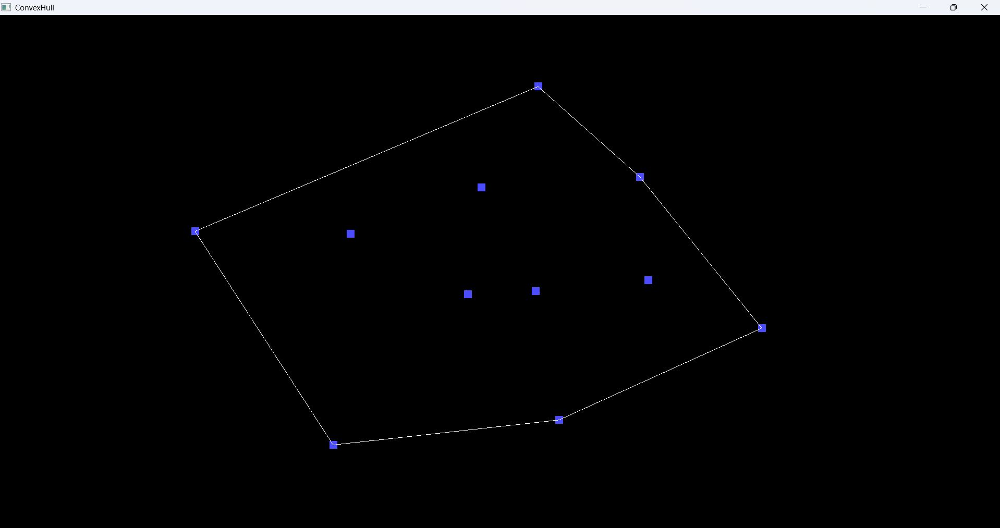

# ConvexHull
Demonstration of the various convex hull algorithms

## What is a convex hull?
- Given a set of points, the convex hull is the smallest convex shape that can enclose all the points. It can be visualized as the shape formed by stretching a rubber band around the outermost points.
- Just like the rubber-band, we try to maximize the area of the hull, while keeping the perimeter as minimum and ensuring that all the points are enclosed within the hull.

## What are its applications?
- It is used in a lot of different fields, but I will list the ones that I have used:
	- Computer Graphics: You can use it to find the bounding box for a given 3d model, using its vertices as the input points for implementing a narrow-phase collision detection within your games.
	- Robotics: It can be used to find the workspace of a robot, given the positions of its joints and links.

## What does the current implementation include?
- Currently I am using a brute-force approach to find the convex hull, which is not the most efficient algorithm, but it is super quick to implement and hence this was my first choice. Soon, I'll be adding more efficient implementations like the "Jarvis March (Gift Wrapping Algo)" and the "Graham Scan" algorithms.
- This brute-force approach works by checking every possible combination of points to see if they form a convex hull. Which has a complexity of O(n^3).
- The main goal was to create a visual demonstration of the convex hull, this allows place points and see how the convex hull changes in real-time.
- The current implementation also handles the degenerate cases, such as when all points are collinear or when there are duplicate points. In these cases, the algorithm will still return a valid convex hull, which may be a line segment or a single point.

## How to use it?
- If you're using Windows, you can simply open the project solution in Visual Studio and run the project. The program will open a window where you can click to add points, and it will display the convex hull in real-time.
- For Linux and MacOS, you can write a CMake script to build the project and run it from the terminal. The project structure is quite simple and writing a CMake would be pretty straight-forward.
- Simply click on the window to add points, and then when you're done, you can press the "SPACE-KEY" to compute the convex hull.

## Tech Stack
- C++: The main programming language used for implementing the convex hull algorithms.
- OpenGL: Used for rendering the points and the convex hull in a graphical window.

## Future Plans
- Implement more efficient convex hull algorithms like "Jarvis March" and "Graham Scan". With a profiler to compare the performance of all the algorithms.

## For a deeper-dive, you can refer to my blog post on this topic: [Convex Hull Algorithms Explained](https://aayushbade14.github.io/Portfolio)